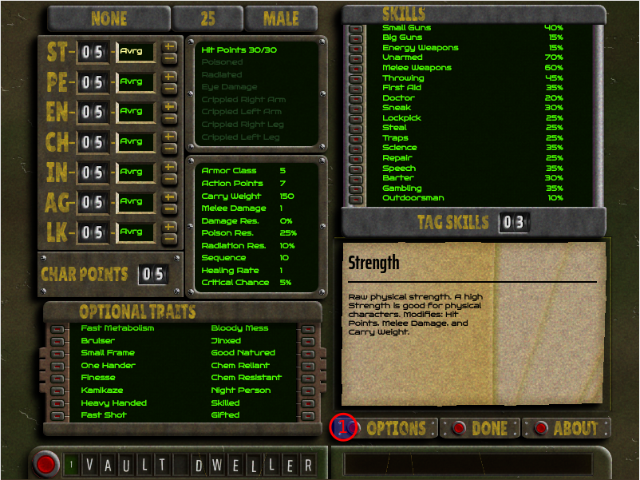
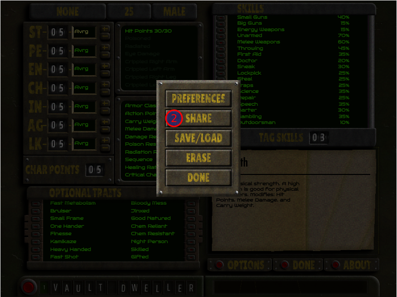
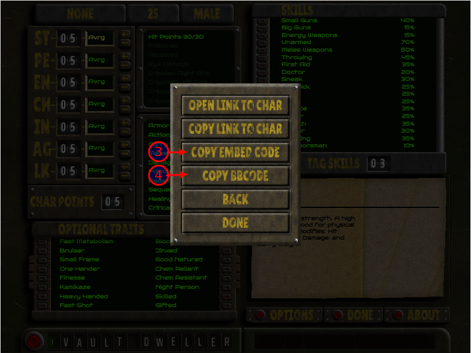

# Nuclear Wasteland Character Planner

**Table of contents:**

- [Why?](#why)
- [Via Share Menu](#share)
- [Via Custom Embed Element](#custom)
- [Via BBCode](#bbcode)

## Embedding

I've provided a custom element to assist with embedding / prevent excessive resource usage when embedding a NWCP character plan.

### Why? <a id="why" href="#why">&#128279;</a>

A regular `iframe` embed would load as soon as your webpage loads, and would remain loaded even if you scrolled the character build offscreen. To save on resource usage and keep pages performant, I've added a layer that detects when the embedded character should be visible, and loads it right then, and as soon as you scroll away, it unloads it.

Also with a custom element I can simplify the "code" of the embed.

### Via Share Menu <a id="share" href="#share">&#128279;</a>

Open options menu  



Open share menu  



Choose Embed type<a id="embed4"></a>  




### Via Custom Embed Element <a id="custom" href="#custom">&#128279;</a>

In your HTML's `<head>` element:

```html
<script
  type="text/javascript"
  src="https://nwcp.vercel.app/c.js"
></script>
```

**Optional** you can set the width of the embedded builds with `css`:

```html
<style type="text/css">
  nw-cp {
    width: 800px;
  }
</style>
```

Wherever you want the character build to be displayed:

```html
<nw-cp char="#EMBED_CODE#"></nw-cp>
```

Where `#EMBED_CODE#` is the encoded data after the hash-mark in your character's URL.

### Via XenForo custom bbcode <a id="bbcode" href="#bbcode">&#128279;</a>

Following the [XenForo custom bbcode guide](https://xenforo.com/docs/xf2/bbcode/#custom-bb-codes)

1. Set the **BB code tag** to `NWCP`
1. Set the **Title** to `Nuclear Wasteland Character Planner Embed`
1. Use **simple replacement** when asked for the **replacement mode**
1. Set HTML replacement to:

```html
<script
  type="text/javascript"
  src="https://nwcp.vercel.app/c.js"
></script>
<nw-cp char="{option}"></nw-cp>
```

5. **Optional**: set icon to [radiation](https://fontawesome.com/icons/radiation?f=classic&s=solid)
6. Characters can now be embedded in your forum posts with the **BBCode** option from the share menu [Mark #4](#embed4).
